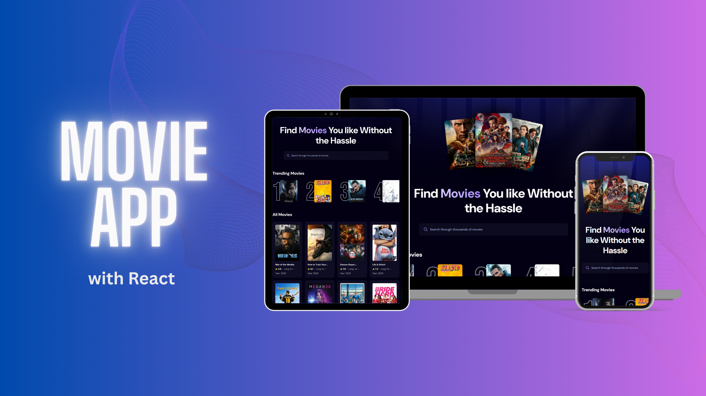

# 🎬 React Movie Page

A modern, responsive movie discovery application built with React, Vite, and Tailwind CSS. Search through thousands of movies, view trending films, and explore detailed movie information with a beautiful, user-friendly interface.

## ✨ Features

- **🔍 Movie Search**: Search through thousands of movies with real-time debounced search
- **📈 Trending Movies**: View the most searched movies with dynamic trending rankings
- **🎨 Modern UI**: Beautiful, responsive design with Tailwind CSS
- **⚡ Fast Performance**: Built with Vite for lightning-fast development and builds
- **📱 Mobile Responsive**: Fully responsive design that works on all devices
- **🌟 Movie Ratings**: Display movie ratings, release years, and language information
- **💾 Search Analytics**: Track search history using Appwrite database

## 🚀 Demo
**[Live Preview](https://mhn-sathsara.github.io/MoviePage-with-react-19/)**
 <!-- Add your screenshot here -->

## 🛠️ Tech Stack

- **Frontend**: React 19.1.0
- **Build Tool**: Vite 7.0.4
- **Styling**: Tailwind CSS 4.1.11
- **API**: The Movie Database (TMDB) API
- **Database**: Appwrite (for search analytics)
- **Utilities**: react-use (for debouncing)
- **Linting**: ESLint with React hooks support

## 📋 Prerequisites

Before running this project, make sure you have:

- Node.js (version 16 or higher)
- npm or yarn package manager
- TMDB API key
- Appwrite account and project setup

## ⚙️ Installation

1. **Clone the repository**

   ```bash
   git clone https://github.com/yourusername/react-moviepage.git
   cd react-moviepage
   ```

2. **Install dependencies**

   ```bash
   npm install
   ```

3. **Set up environment variables**

   Create a `.env.local` file in the root directory and add:

   ```env
   VITE_TMDB_API_KEY=your_tmdb_api_key_here
   VITE_APPWRITE_PROJECT_ID=your_appwrite_project_id
   VITE_APPWRITE_DATABASE_ID=your_appwrite_database_id
   VITE_APPWRITE_COLLECTION_ID=your_appwrite_collection_id
   ```

4. **Start the development server**

   ```bash
   npm run dev
   ```

5. **Open your browser**

   Navigate to `http://localhost:5173` to view the application.

## 🔑 API Setup

### TMDB API

1. Visit [The Movie Database](https://www.themoviedb.org/)
2. Create an account and request an API key
3. Add your API key to the `.env.local` file

### Appwrite Setup

1. Create an [Appwrite](https://appwrite.io/) account
2. Create a new project
3. Set up a database with a collection for search analytics
4. Add your Appwrite credentials to the `.env.local` file

## 📁 Project Structure

```
react-moviepage/
├── public/
│   ├── hero.png
│   ├── search.svg
│   ├── star.svg
│   └── no-movie.png
├── src/
│   ├── components/
│   │   ├── MovieCard.jsx
│   │   ├── Search.jsx
│   │   └── Spinner.jsx
│   ├── App.jsx
│   ├── appwrite.js
│   ├── index.css
│   └── main.jsx
├── .env.local
├── .gitignore
├── eslint.config.js
├── index.html
├── package.json
├── vite.config.js
└── README.md
```

## 🎯 Usage

### Searching Movies

- Use the search bar to find movies by title
- Search results update automatically with debounced input
- View movie details including ratings, release year, and language

### Trending Movies

- The trending section shows the most searched movies
- Trending is based on user search activity stored in Appwrite
- Movies are ranked by search frequency

### Movie Information

- Each movie card displays:
  - Movie poster
  - Title
  - Rating (out of 10)
  - Original language
  - Release year

## 🚀 Available Scripts

- `npm run dev` - Start development server
- `npm run build` - Build for production
- `npm run preview` - Preview production build
- `npm run lint` - Run ESLint

## 🎨 Customization

### Styling

The project uses Tailwind CSS with custom theme configuration. You can modify styles in:

- `src/index.css` - Global styles and Tailwind customizations
- Component-specific classes are defined using Tailwind utilities

### API Configuration

Movie data is fetched from TMDB API. You can modify the API endpoints in `src/App.jsx`:

- Search endpoint: `/search/movie`
- Discovery endpoint: `/discover/movie`

## 🤝 Contributing

1. Fork the project
2. Create your feature branch (`git checkout -b feature/AmazingFeature`)
3. Commit your changes (`git commit -m 'Add some AmazingFeature'`)
4. Push to the branch (`git push origin feature/AmazingFeature`)
5. Open a Pull Request

## 📝 License

This project is licensed under the MIT License - see the [LICENSE](LICENSE) file for details.

## 🙏 Acknowledgments

- [The Movie Database (TMDB)](https://www.themoviedb.org/) for providing the movie API
- [Appwrite](https://appwrite.io/) for backend services
- [Tailwind CSS](https://tailwindcss.com/) for the styling framework
- [Vite](https://vitejs.dev/) for the build tool
- [JavaScript Mastery](https://www.youtube.com/watch?v=dCLhUialKPQ&t=7394s) for the tutorial inspiration

⭐ If you found this project helpful, please give it a star!
